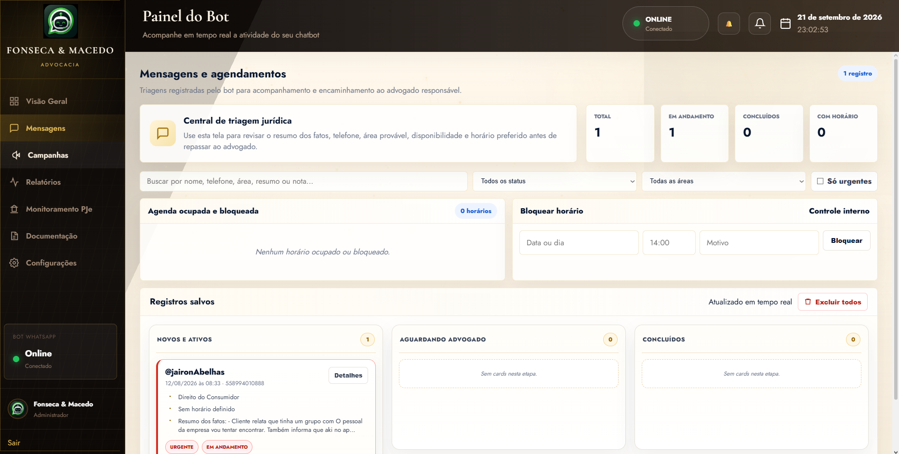

<div align="center">

# Victor A. — Portfolio

### Produtos digitais, inteligência artificial e automações que trabalham de verdade.

[](https://jvalvim-bit.github.io/Victor-Dev-PortfolioOfc/)
[](https://github.com/jvalvim-bit/Victor-Dev-PortfolioOfc/actions)
[](#)

</div>

---

## Sobre o projeto

Este é o portfólio oficial de **Victor Azevedo**, desenvolvedor de sistemas em São Luís, Maranhão. A experiência visual foi inspirada em um quadro de trabalho físico: papéis, cartões, alfinetes, giz, texturas e projetos distribuídos em profundidade.

O site apresenta trabalhos com **chatbots**, **inteligência artificial**, **automação jurídica**, produtos SaaS e experiências em tempo real — com foco especial no **Chatbot Fonseca & Macedo** e no **MyDesk**.

## Experiência visual

- Quadro escuro texturizado com elementos desenhados à mão.
- Navegação fixa, animações de entrada e parallax.
- Perfil profissional com README visual do GitHub.
- Activity graph interativo, com tooltip diário e navegação por teclado.
- Mural horizontal de projetos com profundidade 3D.
- Cards que centralizam, avançam em perspectiva e acompanham o ponteiro.
- Ferramentas de giz para desenhar diretamente no quadro.
- Layout responsivo para desktop e dispositivos móveis.
- Respeito à preferência `prefers-reduced-motion`.

## Projetos em destaque

### Chatbot Fonseca & Macedo

Atendimento jurídico integrado ao WhatsApp, com automações de triagem, documentos, agendamentos, painel administrativo e acompanhamento em tempo real.

**Tecnologias:** Node.js, Electron, WhatsApp Web.js, Supabase e Socket.IO.



### MyDesk

Workspace corporativo e CRM para reunir clientes, contratos, financeiro, pessoas, campanhas e colaboração em uma experiência única.

**Tecnologias:** JavaScript, Firebase, Vercel, APIs externas e recursos em tempo real.


## Estrutura

```text
Victor-Dev-PortfolioOfc/
├── assets/
│   ├── chatbot-fonseca-macedo.png
│   ├── github-readme-terminal.png
│   ├── mydesk.png
│   └── victor-profile.jpg
├── scripts/
│   └── sync-github.mjs
├── .github/workflows/
│   └── pages.yml
├── github-data.js
├── index.html
├── script.js
└── styles.css
```

## Executando localmente

O projeto não exige instalação de dependências. Basta servir a pasta com qualquer servidor estático:

```bash
npx serve .
```

Depois, abra o endereço exibido no terminal.

## Sincronizando a atividade do GitHub

O script consulta o calendário público do perfil `jvalvim-bit` e recria o arquivo utilizado pela interface:

```bash
node scripts/sync-github.mjs
```

O workflow do GitHub Pages executa essa sincronização em cada publicação, mantendo datas, níveis e tooltips atualizados.

## Publicação

O deploy é realizado automaticamente pelo **GitHub Actions** sempre que há um push na branch `main`. O site publicado fica disponível em:

**https://jvalvim-bit.github.io/Victor-Dev-PortfolioOfc/**

## Autor

**Victor Azevedo**  
São Luís, Maranhão, Brasil  
[github.com/jvalvim-bit](https://github.com/jvalvim-bit)

---

<div align="center">
  <sub>Projetado e desenvolvido com cuidado — um commit de cada vez.</sub>
</div>
